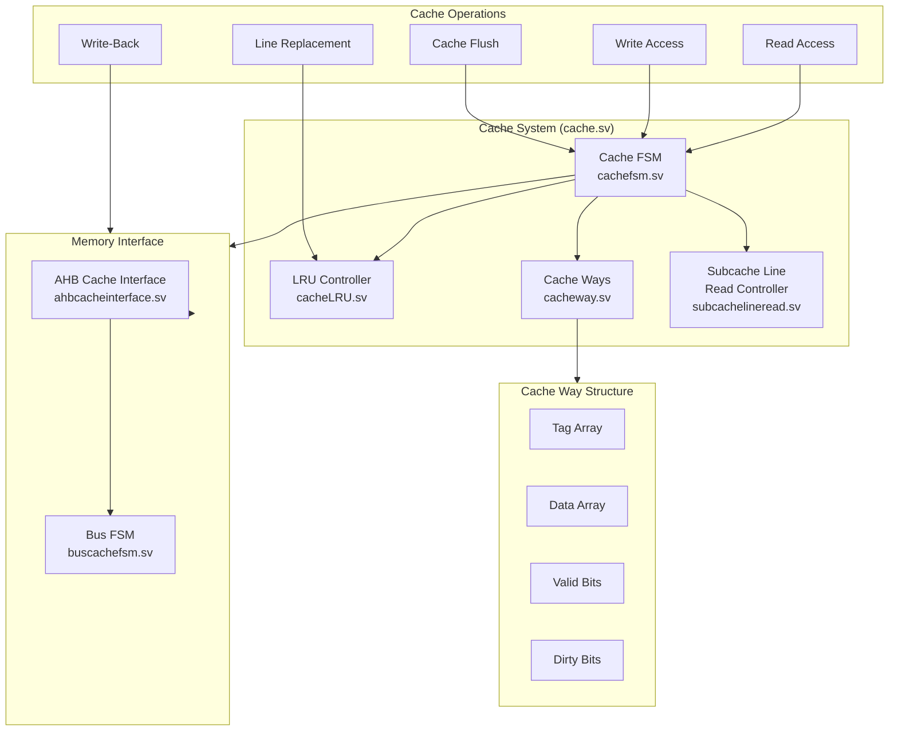

# Cache System Architecture

The Cache System provides fast access to frequently used data and instructions, bridging the performance gap between the core and main memory.

## Architecture Overview

## Major Components

### Cache Controller (cache.sv)
- Main cache control unit
- Handles cache access requests
- Coordinates between components
- Manages cache coherency
- Implements cache policies

### Cache FSM (cachefsm.sv)
- Controls cache operation sequences
- States:
  - IDLE: Waiting for requests
  - READ: Handling read operations
  - WRITE: Processing writes
  - MISS: Managing cache misses
  - WRITEBACK: Writing dirty lines
  - FILL: Loading new cache lines
- Handles transitions between states
- Controls timing of operations

### Cache Way Management

#### Cache Ways (cacheway.sv)
- Individual cache way implementation
- Components per way:
  - Tag array
  - Data array
  - Valid bits
  - Dirty bits
- Parallel tag comparison
- Data access control

#### LRU Controller (cacheLRU.sv)
- Implements Least Recently Used policy
- Tracks way usage
- Selects victims for replacement
- Updates usage information
- Optimizes hit rate

### Memory Interface

#### AHB Cache Interface (ahbcacheinterface.sv)
- Interfaces with AHB bus
- Handles bus protocol
- Manages bus transactions
- Controls data transfer

#### Bus Cache FSM (buscachefsm.sv)
- Controls bus operations
- Manages burst transfers
- Handles bus errors
- Coordinates with main FSM

### Subcache Line Read Controller (subcachelineread.sv)
- Manages partial line reads
- Optimizes bandwidth usage
- Reduces latency for partial accesses
- Controls granular data access

## Cache Operations

### Read Access
1. **Tag Check**
   - Compare address tag
   - Check valid bit
   - Parallel way lookup

2. **Hit Processing**
   - Return data
   - Update LRU
   - Single cycle for hits

3. **Miss Processing**
   - Select victim way
   - Write-back if dirty
   - Fetch new line
   - Update cache contents

### Write Access
1. **Write Hit**
   - Update data
   - Set dirty bit
   - Update LRU

2. **Write Miss**
   - Allocate line
   - Fetch rest of line
   - Perform write
   - Set dirty bit

### Cache Maintenance
- **Flush Operations**
  - Write-back dirty lines
  - Invalidate entries
  - Reset state

- **Write-Back**
  - Dirty line detection
  - Bus transaction initiation
  - Clean bit management

## Performance Features

### Optimization Techniques
- Multi-way set associative
- Critical word first
- Subcache line access
- Write-back policy
- LRU replacement

### Timing Characteristics
- Single-cycle hit latency
- Pipelined tag/data access
- Optimized miss handling
- Efficient bus utilization

### Configuration Options
- Configurable cache size
- Adjustable associativity
- Tunable line size
- Flexible replacement policy

## Integration with Core

### Interface with MMU
- Virtual address translation
- Permission checking
- Cache attribute control

### Interface with LSU
- Load/Store handling
- Atomic operation support
- Memory barrier processing

### Interface with Bus
- AHB protocol compliance
- Burst transfer support
- Error handling