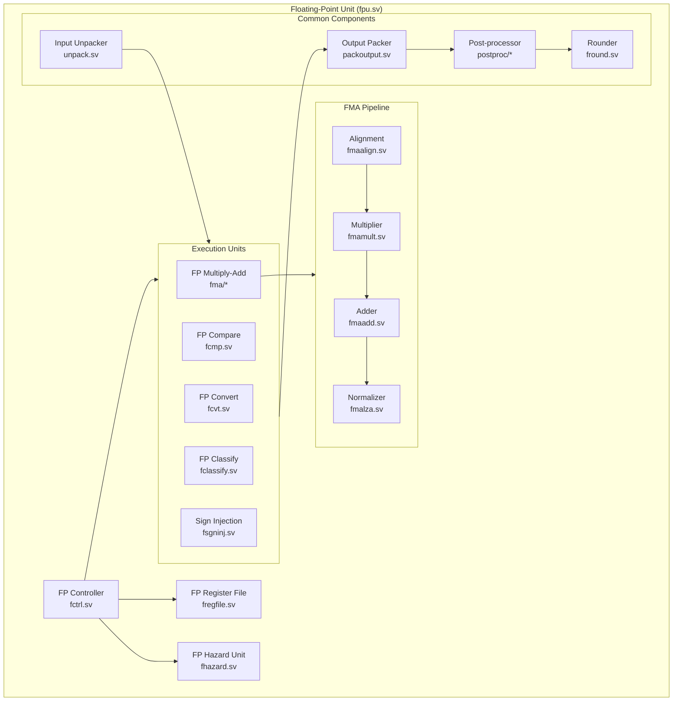

# Floating-Point Unit (FPU)

The Floating-Point Unit implements IEEE 754 floating-point operations, supporting both single and double precision formats.

## Architecture Overview

## Major Components

### Control and Management

#### FP Controller (fctrl.sv)
- Instruction decoding
- Operation scheduling
- Exception handling
- Status flag management
- Pipeline control

#### FP Hazard Unit (fhazard.sv)
- RAW dependency detection
- WAW hazard prevention
- Resource conflict resolution
- Pipeline stall generation
- Forwarding control

#### FP Register File (fregfile.sv)
- 32 floating-point registers
- Single/double precision support
- Dual read ports
- Single write port
- Bypass paths

### Execution Units

#### Fused Multiply-Add Unit (fma/)
The FMA unit is the core computational engine, implementing a4-stage pipeline:

1. **Alignment Stage (fmaalign.sv)**
   - Operand unpacking
   - Exponent processing
   - Mantissa alignment
   - Special case detection

2. **Multiply Stage (fmamult.sv)**
   - Mantissa multiplication
   - Partial product generation
   - Product compression
   - Sign logic

3. **Add Stage (fmaadd.sv)**
   - Addition/subtraction
   - Carry propagation
   - Leading zero anticipation
   - Intermediate normalization

4. **Normalize Stage (fmalza.sv)**
   - Final normalization
   - Rounding preparation
   - Exponent adjustment
   - Result composition

#### Comparison Unit (fcmp.sv)
- Equality comparison
- Less/greater comparison
- Quiet/signaling comparisons
- NaN handling
- Special case processing

#### Conversion Unit (fcvt.sv)
- Float to float conversion
- Float to integer conversion
- Integer to float conversion
- Rounding mode handling
- Range checking

#### Classification Unit (fclassify.sv)
- Number classification
- NaN detection
- Infinity detection
- Zero detection
- Sign analysis

#### Sign Injection Unit (fsgninj.sv)
- Sign manipulation
- Sign extraction
- Sign combination
- Special value handling

### Common Components

#### Input Processing
- **Unpacker (unpack.sv)**
  - Format decoding
  - Field extraction
  - Special value detection
  - Implicit bit handling

#### Output Processing
- **Packer (packoutput.sv)**
  - Result composition
  - Format encoding
  - Special value insertion
  - Status flag generation

#### Post-Processing (postproc/)
- Result normalization
- Rounding control
- Exception generation
- Status flag updates
- Special case handling

#### Rounding Unit (fround.sv)
- IEEE rounding modes
  - Round to nearest even
  - Round toward zero
  - Round toward +∞
  - Round toward -∞
- Sticky bit computation
- Guard bit handling
- Round bit processing

## Floating-Point Features

### Supported Operations
- Add/Subtract
- Multiply
- Fused Multiply-Add
- Compare
- Convert
- Sign manipulation
- Classification

### Precision Support
- Single precision (32-bit)
- Double precision (64-bit)
- Internal extended precision

### IEEE 754 Compliance
- Subnormal number handling
- Exception flags
- Rounding modes
- Special values (NaN, Inf)
- Status register

## Performance Features

### Pipeline Organization
- 4-stage FMA pipeline
- Single-cycle simple operations
- Parallel execution units
- Result forwarding
- Early exception detection

### Optimization Techniques
- Fused multiply-add
- Leading zero anticipation
- Fast rounding
- Parallel NaN/infinity handling
- Efficient subnormal processing

### Exception Handling
- Invalid operation
- Divide by zero
- Overflow
- Underflow
- Inexact result
- Input subnormal