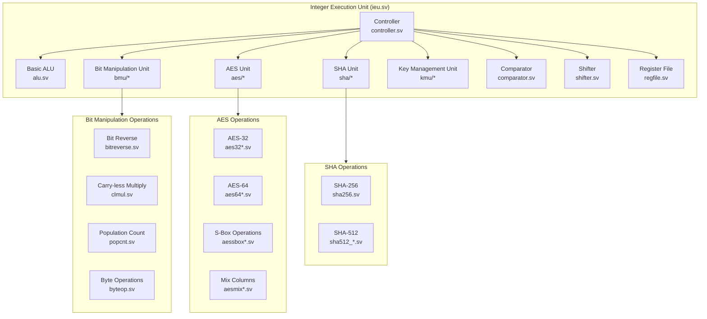

# Integer Execution Unit (IEU)

The Integer Execution Unit (IEU) is a complex module that handles various computational tasks including basic arithmetic, cryptographic operations, and bit manipulation.

## Architecture Overview

## Major Components

### Basic ALU Operations (alu.sv)
- Integer arithmetic operations (add, subtract)
- Logical operations (AND, OR, XOR)
- Comparison operations
- Address calculation for load/store

### Bit Manipulation Unit (bmu/)
- **Bit Reverse**: Reverses the bits in a word
- **Carry-less Multiply**: Multiplication without carry propagation
- **Population Count**: Counts number of set bits
- **Byte Operations**: Various byte-level manipulations
- **Zbb, Zbc Extensions**: RISC-V bit manipulation extensions

### Cryptographic Units

#### AES Unit (aes/)
- Support for both 32-bit and 64-bit AES operations
- Hardware acceleration for:
  - AES encryption/decryption
  - Key schedule generation
  - S-Box transformations
  - Mix columns operations
- Implements RISC-V Cryptography Extension (K)

#### SHA Unit (sha/)
- Hardware acceleration for:
  - SHA-256 hash function
  - SHA-512/256 hash function
  - SHA-512 message scheduling

#### Key Management Unit (kmu/)
- Secure key handling operations
- Implementation of RISC-V Zbkb, Zbkx extensions
- Support for various key sizes and formats

### Support Components
- **Register File**: 32 x XLEN general-purpose registers
- **Shifter**: Barrel shifter for logical/arithmetic shifts
- **Comparator**: Handles all comparison operations
- **Controller**: Orchestrates operation selection and timing

## Pipeline Integration
The IEU is integrated into the main pipeline and:
1. Receives decoded instructions from the IDU
2. Executes operations in parallel when possible
3. Forwards results to the LSU or writeback stage
4. Handles data hazards through forwarding paths

## Performance Features
- Single-cycle execution for basic ALU operations
- Pipelined execution for complex operations
- Parallel execution units for improved throughput
- Hardware acceleration for cryptographic operations