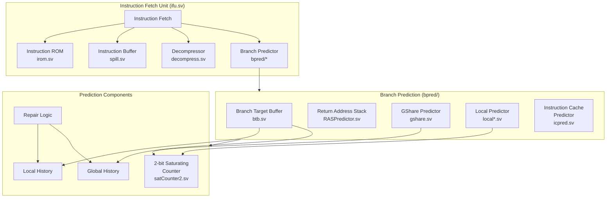

# Instruction Fetch Unit (IFU)

The Instruction Fetch Unit is responsible for fetching instructions and managing control flow, featuring sophisticated branch prediction mechanisms.

## Architecture Overview

## Major Components

### Core IFU Components

#### Instruction Fetch Controller
- PC generation and management
- Instruction alignment
- Cache interface coordination
- Exception handling
- Control transfer processing

#### Instruction Decompressor (decompress.sv)
- RISC-V C extension support
- 16-bit instruction handling
- Expansion to 32-bit format
- Illegal instruction detection
- Performance optimization

#### Instruction Buffer (spill.sv)
- Instruction queueing
- Fetch/decode rate matching
- Branch speculation support
- Recovery mechanism
- Pipeline bubble management

### Branch Prediction System

#### Branch Target Buffer (btb.sv)
- Branch target caching
- Target address prediction
- Branch type identification
- Way-associative structure
- Tag matching logic

#### Return Address Stack (RASPredictor.sv)
- Call/return prediction
- Stack operation management
- Speculative updates
- Recovery mechanism
- Overflow handling

#### GShare Predictor (gshare.sv)
- Global history correlation
- Pattern history table
- XOR-based indexing
- Counter saturation logic
- Update mechanism

#### Local Predictors
1. **Local Ahead BP (localaheadbp.sv)**
   - Per-branch history tables
   - Look-ahead prediction
   - Pattern matching
   - Early resolution

2. **Local Basic BP (localbpbasic.sv)**
   - Simple local prediction
   - History-based decisions
   - Basic pattern recognition

3. **Local Repair BP (localrepairbp.sv)**
   - Misprediction recovery
   - State restoration
   - History repair
   - Quick recovery paths

#### Instruction Cache Predictor (icpred.sv)
- Cache hit/miss prediction
- Prefetch decisions
- Access pattern learning
- Latency hiding

### Prediction Components

#### History Management
- **Global History**
  - Shared branch history
  - Shift register implementation
  - Speculative updates
  - Recovery mechanism

- **Local History**
  - Per-branch history tables
  - Pattern storage
  - Update logic
  - Table management

#### 2-bit Saturating Counter (satCounter2.sv)
- Four states:
  - Strongly Not Taken
  - Weakly Not Taken
  - Weakly Taken
  - Strongly Taken
- Hysteresis behavior
- Update policies
- Reset handling

#### Repair Logic
- Misprediction detection
- State restoration
- History repair
- Pipeline flush control
- Recovery coordination

## Instruction Flow

### Fetch Process
1. **PC Generation**
   - Next PC calculation
   - Branch prediction input
   - Exception handling
   - Interrupt processing

2. **Instruction Access**
   - Cache/ROM access
   - Wait state handling
   - Error detection
   - Alignment checking

3. **Instruction Processing**
   - Decompression
   - Buffer management
   - Prediction tagging
   - Exception marking

### Branch Handling

#### Prediction Phase
1. **Target Prediction**
   - BTB lookup
   - RAS consultation
   - Direction prediction
   - Confidence estimation

2. **History Update**
   - Speculative update
   - Pattern recording
   - Counter adjustment
   - State tracking

#### Resolution Phase
1. **Prediction Verification**
   - Actual outcome comparison
   - Target verification
   - Type confirmation
   - Exception checking

2. **Recovery Handling**
   - State restoration
   - History repair
   - Pipeline control
   - Buffer management

## Performance Features

### Prediction Accuracy
- Multiple predictor types
- History correlation
- Pattern learning
- Confidence estimation
- Hybrid prediction

### Latency Optimization
- Look-ahead prediction
- Parallel lookups
- Early resolution
- Quick recovery
- Speculative execution

### Resource Management
- Buffer allocation
- History table sizing
- Counter saturation
- Stack depth
- Cache utilization

### Special Features
- RVC support
- Exception handling
- Interrupt processing
- Debug support
- Performance counters