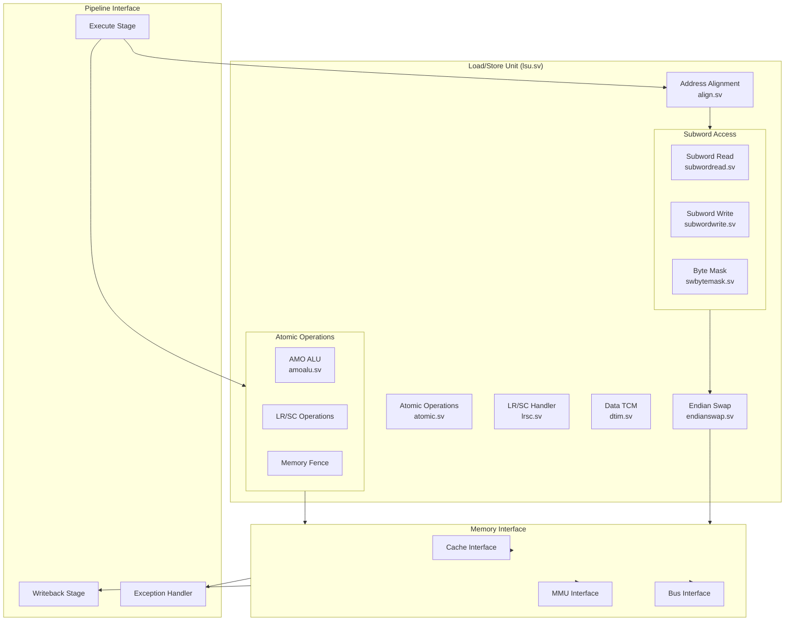

# Load/Store Unit (LSU)

The Load/Store Unit manages all memory operations, including atomic operations and memory ordering, while handling data alignment and memory barriers.

## Architecture Overview

## Major Components

### Core LSU Components

#### Address Alignment (align.sv)
- Address validation
- Alignment checking
- Exception generation
- Access size handling
- Address translation request

#### Endian Swap (endianswap.sv)
- Byte reordering
- Half-word swapping
- Word swapping
- Double-word handling
- Configuration control

#### Data TCM (dtim.sv)
- Tightly-coupled memory
- Fast access path
- Direct addressing
- Size configuration
- Access control

### Subword Access Handling

#### Subword Read (subwordread.sv)
- Byte extraction
- Half-word alignment
- Sign extension
- Zero extension
- Merge logic

#### Subword Write (subwordwrite.sv)
- Byte insertion
- Half-word placement
- Data merging
- Write strobes
- Byte enables

#### Byte Mask Generation (swbytemask.sv)
- Access size decoding
- Byte enable generation
- Address alignment
- Write strobe creation
- Exception checking

### Atomic Operations

#### Atomic Memory Operations (amoalu.sv)
- AMO execution unit
- Operation types:
  - ADD/AND/OR/XOR
  - MIN/MAX (signed/unsigned)
  - SWAP
- Result computation
- Status handling

#### LR/SC Handler (lrsc.sv)
- Load-Reserved tracking
- Store-Conditional validation
- Reservation station
- Address monitoring
- Success/failure handling

#### Memory Ordering
- FENCE instruction handling
- Memory barriers
- Store buffer management
- Load-after-Store handling
- Store-after-Load ordering

## Operation Types

### Basic Memory Operations

#### Load Operations
1. **Load Byte**
   - Signed/Unsigned
   - Alignment handling
   - Exception checking
   - Sign extension

2. **Load Half-word**
   - Signed/Unsigned
   - Half-word alignment
   - Endian swapping
   - Exception handling

3. **Load Word**
   - Word alignment
   - Cache access
   - MMU translation
   - Exception detection

4. **Load Double-word**
   - Double-word alignment
   - Split access handling
   - Cache line crossing
   - Exception management

#### Store Operations
1. **Store Byte**
   - Byte selection
   - Merge logic
   - Write enable
   - Exception checking

2. **Store Half-word**
   - Half-word placement
   - Alignment handling
   - Byte enables
   - Exception detection

3. **Store Word**
   - Word alignment
   - Cache update
   - Write-through/back
   - Exception handling

4. **Store Double-word**
   - Double-word placement
   - Split write handling
   - Cache management
   - Exception detection

### Atomic Operations

#### AMO Operations
- Atomic Add
- Atomic AND/OR/XOR
- Atomic MIN/MAX
- Atomic SWAP
- Status handling

#### LR/SC Operations
1. **Load Reserved**
   - Address reservation
   - Data loading
   - Status tracking
   - Exception handling

2. **Store Conditional**
   - Reservation checking
   - Atomic update
   - Success/failure
   - Status update

### Memory Ordering

#### FENCE Instructions
- FENCE (regular)
- FENCE.I
- Memory barriers
- Pipeline flush
- Buffer management

## Pipeline Integration

### Execute Stage Interface
- Address generation
- Operation decoding
- Exception detection
- Control signal generation
- Forwarding handling

### Memory Stage Operation
- Cache access
- MMU translation
- Atomic execution
- Exception handling
- Result computation

### Writeback Stage Interface
- Result selection
- Status update
- Exception reporting
- Pipeline control
- Register update

## Performance Features

### Access Optimization
- Aligned access fast path
- Unaligned access handling
- Split access management
- Cache line optimization
- TCM integration

### Pipeline Efficiency
- Load-to-use forwarding
- Store buffer
- Write combining
- Access reordering
- Exception prediction

### Memory Ordering
- Relaxed consistency
- Atomic operation handling
- Barrier implementation
- Dependency tracking
- Hazard avoidance

### Exception Handling
- Address misalign
- Access fault
- Page fault
- Protection violation
- Atomic operation failure