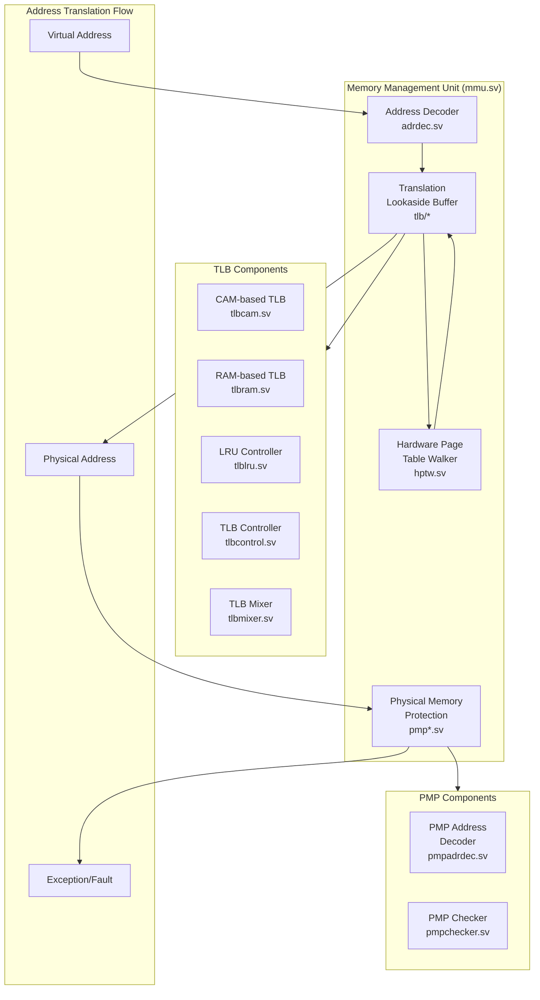

# Memory Management Unit (MMU)

The Memory Management Unit (MMU) handles virtual memory translation and memory protection in the RISC-V processor.

## Architecture Overview

## Major Components

### Address Decoder (adrdec.sv)
- Handles initial virtual address processing
- Separates address into:
  - Virtual Page Number (VPN)
  - Page Offset
- Supports multiple page sizes (4KB, 2MB, 1GB)
- Implements Sv39/Sv48 virtual memory schemes

### Translation Lookaside Buffer (tlb/)

#### TLB Architecture
- **CAM-based TLB (tlbcam.sv)**
  - Content-Addressable Memory for fast lookups
  - Fully associative structure
  - Stores most recently used translations

- **RAM-based TLB (tlbram.sv)**
  - Set-associative structure
  - Higher capacity than CAM
  - More power-efficient for larger sets

- **TLB Control Logic**
  - LRU replacement policy (tlblru.sv)
  - TLB entry management (tlbcontrol.sv)
  - Result mixing from CAM/RAM (tlbmixer.sv)

#### TLB Operations
- Virtual to Physical address translation
- Page permission checking
- Address space ID (ASID) management
- TLB invalidation and flushing

### Hardware Page Table Walker (hptw.sv)
- Automatically walks page tables on TLB miss
- Supports multi-level page tables
- Handles page faults and access exceptions
- Prefetches page table entries

### Physical Memory Protection (PMP)

#### PMP Components
- **Address Decoder (pmpadrdec.sv)**
  - Decodes physical addresses
  - Matches against PMP regions

- **PMP Checker (pmpchecker.sv)**
  - Validates access permissions
  - Enforces memory protection rules
  - Generates protection violations

#### PMP Features
- Configurable protection regions
- Multiple addressing modes:
  - Top-of-Range (TOR)
  - Naturally Aligned Four-byte region (NA4)
  - Naturally Aligned Power-of-2 region (NAPOT)
- Access type checking (R/W/X)
- Machine mode bypass options

## Address Translation Process

1. **Initial Processing**
   - Virtual address received from IFU/LSU
   - Address decoded and page size determined
   - ASID and privilege level checked

2. **TLB Lookup**
   - Parallel CAM and RAM TLB lookup
   - Permission bits checked
   - Hit: Physical address generated
   - Miss: HPTW activated

3. **Page Table Walk**
   - HPTW traverses page table levels
   - Loads PTEs from memory
   - Updates TLB with new translation
   - Handles page faults

4. **Physical Memory Protection**
   - Physical address checked against PMP regions
   - Access permissions validated
   - Protection violations generate exceptions

## Exception Handling
- Page Fault (Instruction/Load/Store)
- Access Fault
- PMP Violation
- TLB Miss Exception
- Page Table Walk Failure

## Performance Features
- Parallel TLB lookup paths
- Hardware page table walker
- Multiple page sizes support
- Efficient replacement policies
- Protection checking in parallel with translation