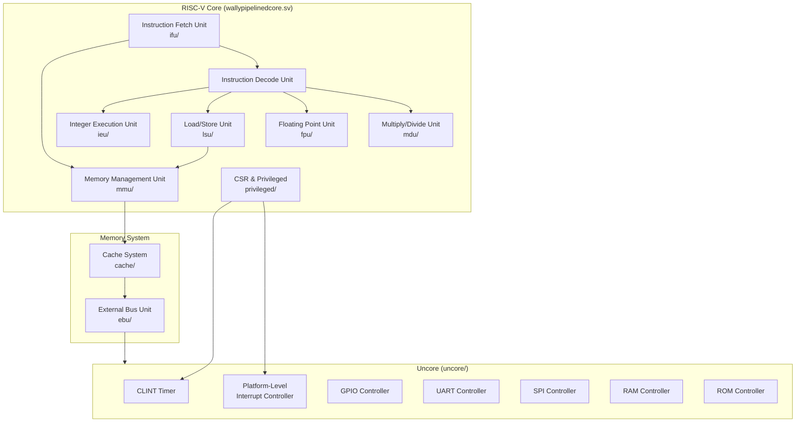

# SoC Architecture Overview

This document provides an overview of the RISC-V SoC architecture implemented in the CVW project.

## High-Level Architecture

## Major Components

### Core
- **IFU (Instruction Fetch Unit)**: Handles instruction fetch, branch prediction, and instruction decompression
- **IEU (Integer Execution Unit)**: Performs integer arithmetic, logical operations, and includes specialized units for:
  - AES encryption/decryption
  - SHA hashing
  - Bit manipulation
  - Key management
- **LSU (Load/Store Unit)**: Manages data memory access, atomic operations, and memory alignment
- **FPU (Floating Point Unit)**: Handles floating-point arithmetic operations
- **MDU (Multiply/Divide Unit)**: Dedicated unit for multiplication and division operations
- **MMU (Memory Management Unit)**: Handles virtual memory translation and protection

### Memory System
- **Cache**: Implements cache memory hierarchy
- **EBU (External Bus Unit)**: Manages external bus protocols and memory interfaces

### Uncore Peripherals
- **CLINT**: Core-Local Interrupt Controller
- **PLIC**: Platform-Level Interrupt Controller
- **GPIO**: General Purpose I/O interface
- **UART**: Universal Asynchronous Receiver/Transmitter
- **SPI**: Serial Peripheral Interface
- **Memory Controllers**: RAM and ROM interfaces

## Directory Structure
The hardware is organized into the following main directories:
- `src/wally/`: Top-level SoC and core files
- `src/cache/`: Cache implementation
- `src/ebu/`: External bus unit
- `src/fpu/`: Floating-point unit
- `src/ieu/`: Integer execution unit
- `src/ifu/`: Instruction fetch unit
- `src/lsu/`: Load/store unit
- `src/mdu/`: Multiply/divide unit
- `src/mmu/`: Memory management unit
- `src/privileged/`: CSR and privileged mode handling
- `src/uncore/`: Peripheral controllers and bus infrastructure