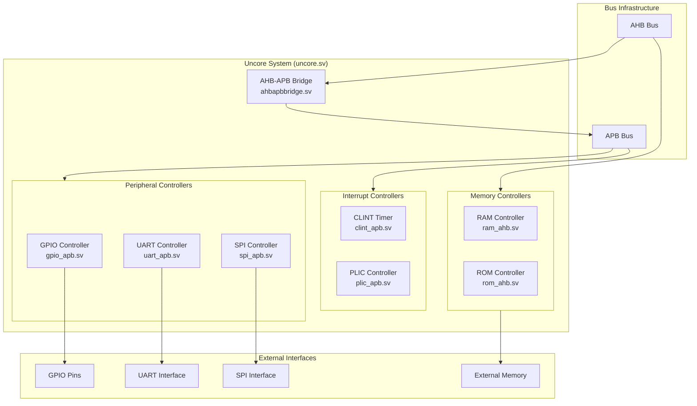

# Uncore Components

The Uncore components provide essential system-level functionality, including interrupt controllers, timers, and peripheral interfaces.

## Architecture Overview

## Major Components

### Bus Infrastructure

#### AHB-APB Bridge (ahbapbbridge.sv)
- Protocol conversion
- Address decoding
- Clock domain crossing
- Error handling
- Bus arbitration

### Interrupt Controllers

#### CLINT Timer (clint_apb.sv)
- Machine-mode timer interrupts
- Real-time counter
- Time comparison
- Software interrupts
- APB slave interface

#### PLIC Controller (plic_apb.sv)
- External interrupt handling
- Priority management
- Interrupt routing
- Context control
- Interrupt claiming/completion

### Peripheral Controllers

#### GPIO Controller (gpio_apb.sv)
- Pin direction control
- Input/output management
- Interrupt generation
- Pin multiplexing
- APB slave interface

#### UART Controller (uart_apb.sv)
- PC16550D compatible
- Baud rate generation
- FIFO buffers
- Flow control
- Interrupt generation

#### SPI Controller (spi_apb.sv)
Components:
- **Controller Core (spi_controller.sv)**
  - Protocol handling
  - Clock generation
  - Chip select management
  - Transfer control
  
- **FIFO Management (spi_fifo.sv)**
  - Transmit buffer
  - Receive buffer
  - Status flags
  - Interrupt generation

### Memory Controllers

#### RAM Controller (ram_ahb.sv)
- AHB slave interface
- Memory access control
- Wait state generation
- Error detection
- Burst support

#### ROM Controller (rom_ahb.sv)
- Boot code storage
- Read-only access
- AHB slave interface
- Error handling
- Address decoding

## Bus Architecture

### AHB Bus
- High-performance bus
- Pipelined operations
- Burst transfers
- Multiple masters
- Split transactions

### APB Bus
- Peripheral control
- Simple interface
- Single-cycle transfers
- Low power
- Easy integration

## Peripheral Details

### GPIO System

#### Features
- Configurable pins
- Input/output modes
- Interrupt capability
- Edge/level detection
- Debounce support

#### Operations
- Pin configuration
- Data reading/writing
- Interrupt management
- Status monitoring
- Direction control

### UART System

#### Features
- Multiple baud rates
- Hardware flow control
- 16550 compatibility
- FIFO buffers
- Interrupt support

#### Operations
- Data transmission
- Flow control
- Error detection
- FIFO management
- Status monitoring

### SPI System

#### Features
- Master mode operation
- Multiple chip selects
- Configurable clock
- FIFO buffering
- DMA support

#### Operations
- Data transfer
- Clock generation
- Chip select control
- Status monitoring
- Error handling

## Interrupt Architecture

### CLINT Implementation
- Timer configuration
- Counter management
- Comparison logic
- Interrupt generation
- Software interrupts

### PLIC Features
- Multiple sources
- Priority levels
- Enable/disable control
- Context handling
- Interrupt routing

## Memory Management

### RAM Controller
- Address mapping
- Access control
- Wait state insertion
- Error handling
- Burst support

### ROM Controller
- Boot code access
- Read-only protection
- Error detection
- Address decoding
- Status reporting

## Integration Features

### Clock Domain Management
- Multiple domains
- Synchronization
- Clock gating
- Reset control
- Power management

### Reset Control
- System reset
- Peripheral reset
- Power-on reset
- Warm reset
- Debug reset

### Error Handling
- Bus errors
- Timeout detection
- Invalid access
- Status reporting
- Error recovery

### Debug Support
- Debug interface
- Status registers
- Control registers
- Error logging
- Performance monitoring

## Performance Features

### Bus Optimization
- Pipelined transfers
- Burst operations
- Split transactions
- Bus parking
- Priority arbitration

### Peripheral Performance
- DMA support
- FIFO buffering
- Interrupt coalescing
- Status polling
- Error recovery

### Memory Access
- Burst transfers
- Wait state optimization
- Error detection
- Access prioritization
- Cache support

### Power Management
- Clock gating
- Power domains
- Sleep modes
- Wake-up control
- Activity monitoring