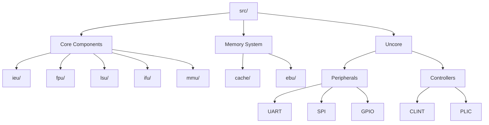

# CVW RISC-V Processor Documentation

Welcome to the documentation for the CVW RISC-V processor implementation. This documentation provides detailed information about the processor's architecture, components, and functionality.

## Architecture Overview

The CVW processor is a RISC-V implementation featuring:
- RV64GC ISA support (64-bit, General-purpose extensions, Compressed instructions)
- Hardware floating-point unit (F and D extensions)
- Virtual memory support with MMU
- Advanced branch prediction
- Multi-level cache system
- Rich set of peripherals

## Major Components

### Core Components
- [Integer Execution Unit (IEU)](hardware/ieu-architecture.md) - Handles integer arithmetic, cryptography, and bit manipulation
- [Floating-Point Unit (FPU)](hardware/fpu-architecture.md) - Implements IEEE 754 floating-point operations
- [Load/Store Unit (LSU)](hardware/lsu-architecture.md) - Manages memory operations and atomic instructions
- [Instruction Fetch Unit (IFU)](hardware/ifu-architecture.md) - Controls instruction fetch and branch prediction
- [Memory Management Unit (MMU)](hardware/mmu-architecture.md) - Handles virtual memory translation and protection

### Memory System
- [Cache System](hardware/cache-architecture.md) - Implements instruction and data caches
- Memory hierarchy management
- External bus interface

### System Components
- [Uncore Components](hardware/uncore-architecture.md) - Peripherals and system controllers
- Interrupt controllers (CLINT and PLIC)
- Debug system
- System timers

## Directory Structure

## Getting Started

To explore the processor architecture in detail, start with these key components:
1. [SoC Architecture Overview](hardware/soc-architecture.md) - High-level system overview
2. [Integer Execution Unit](hardware/ieu-architecture.md) - Core computational unit
3. [Cache System](hardware/cache-architecture.md) - Memory hierarchy
4. [Uncore Components](hardware/uncore-architecture.md) - System peripherals

Each component's documentation includes:
- Architectural diagrams
- Detailed component descriptions
- Interface specifications
- Operation details
- Performance features
